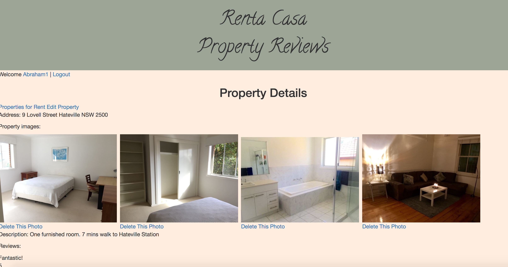

# README

# Project 1

## Description

The project aims to showcase the use of Ruby on Rails in creating a fullstack property website.

## Features

The website features a log in for existing users and sign up for those seeking to access the website. Landlords can put up their property for rent and tenants can use leave reviews of the property. All these are shown on the browser. Users can also edit and delete their listings and reviews.

## Result
Here is [my live site](https://rentacasa.herokuapp.com/login)

## Lessons Learned

I should have kept my ideas simple so that I can meet the necessary deliverables of the project and add more features to it if there was time left.

Planning a wireframe of how the website should appear is essential so that if things do not go according to plan, the wireframe will serve as the reminder of the original plan.

## Wish List

I would have wanted to make the website more presentable as it is still in its rudimentary stage. Other features such as search, google maps and geotagging would have made the site more useful.

## Acknowledgments

I would like to thank Luke Hammer first and foremost for being patient and guiding me in this project without radically changing my codes. Also a message of thanks to Matty for answering all my queries. Finally thank you to Lingxiao and Weijia for taking time to help me debug my website.
